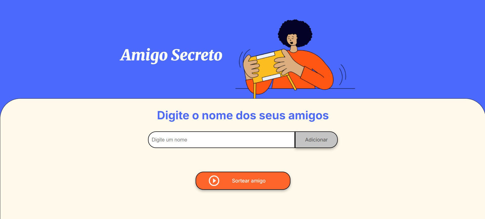

# Alura - Desafio do Amigo Secreto 🎁

Este repositório contém a solução para o **Desafio do Amigo Secreto** do programa **ONE da Alura**. O objetivo do projeto é criar uma aplicação simples onde o usuário pode adicionar nomes de amigos e realizar o sorteio aleatório de um deles.

 

## 🚀 Funcionalidades

- Adicionar nomes de amigos em uma lista.
- Validar entrada (não permitir campos vazios ou nomes repetidos).
- Exibir a lista atualizada de amigos na tela.
- Sortear aleatoriamente um amigo da lista.
- Mostrar o resultado do sorteio diretamente na página.

 

##  💡  Como Utilizar

1 -  No campo de texto, digite o nome de um amigo e clique em **Adicionar**.  

2 - Repita o processo para incluir quantos amigos quiser.  

3 - Clique no botão **Sortear amigo** para escolher aleatoriamente um dos nomes cadastrados.  

 

## 🛠️ Tecnologias utilizadas

- **HTML**
- **CSS**
- **JavaScript**

 

##  👩🏻 Autor(a)

- [Sarah Alves Borges](https://github.com/sarahzxwy)